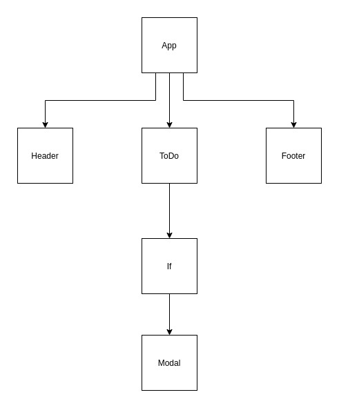

# LAB - 401-lab-31

## Hooks

### Author: Travis Skyles

### Links and Resources

- [submission PR](https://github.com/tskyles-401-advanced-javascript/401-lab-31/pull/1)
- [travis](https://travis-ci.com/tskyles-401-advanced-javascript/401-lab-31)
- [front-end](https://master.dbw6qo6x3ye3m.amplifyapp.com/)
- [back-end](https://todo-backend-lab-32.herokuapp.com/)
- [codesandbox.io](https://codesandbox.io/s/lab-34-dsbjf)

### Setup

- `clone repo to local`
- `open in editor`
- `npm i`
- `npm start`

#### Tests

- `npm test`

#### UML

